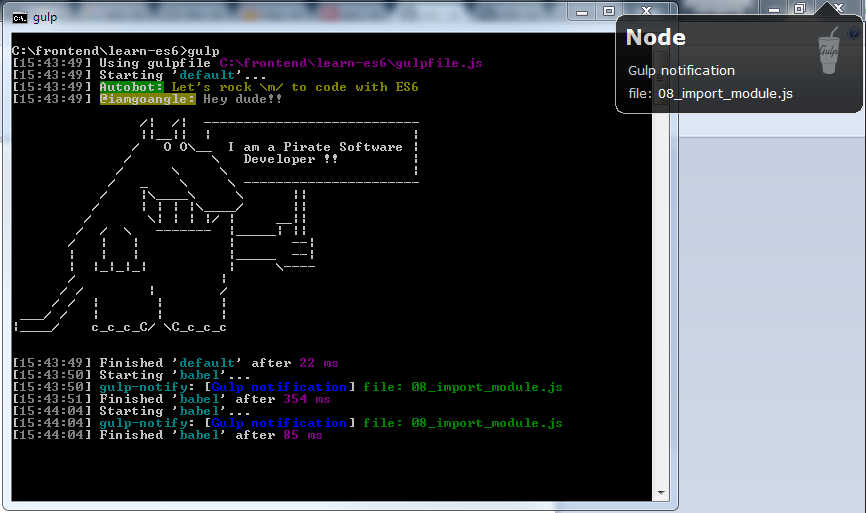

# Learning ES6 (Harmony)
Learning ES6 Harmony

# Prerequisite
1. Installed NodeJS to your machine
2. [Growl for Windows](http://www.growlforwindows.com/gfw/) (Optional)

# Installation
1. Fork or clone this repository
2.`npm install`

# Build (Manual) :metal:
1. Create the directory **/lib** and **/src**
2. Add your ES6 code to **/src**
2. Open cli > `npm run build` native js is built to **/lib**

# Build (Through gulp task) :whale:
1. Open cli > `gulp`

# Stack list
1. gulp
2. gulp-babel
3. gulp-notification
3. babel
4. ES6

# Screenshot

